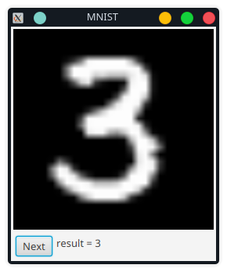

# Clojure ONNX example using MNIST dataset

Download MNIST dataset
```Shell
make mnist
```

Install Python dependencies
```Shell
poetry install
```

Run model training
```Shell
poetry run train
```

Run inference
```Shell
clj -M:infer
```



## External Links

* [MNIST dataset](https://github.com/fgnt/mnist)
* [Using ONNX models from Clojure](https://scicloj.github.io/clojure-data-tutorials/projects/ml/onnx/onnx.html)
* [ONNX runtime](https://onnxruntime.ai/)
* [PyTorch](https://pytorch.org/)
* [Cljfx wrapper for JavaFX](https://github.com/cljfx/cljfx)
* [JavaFX image from a byte array](https://gist.github.com/jamesthompson/3344090)
